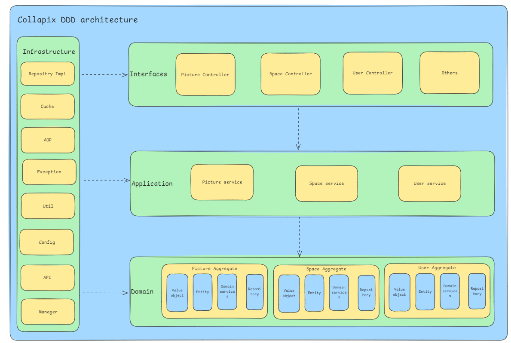

# CollaPix Introduction

> Author: [Steven Chen](https://blog.esmiao.top)

## Project Introduction

The project is based on Vue 3 + Spring Boot + COS + WebSocket.
The web platform repo can check here [CollaPix-app](https://github.com/1347428036/Collapix-app).

This platform has a wide range of application scenarios. Its core functions are divided into 4 major categories.

1. All users can publicly upload and search for image materials on the platform to quickly find the images they need. It can be used as an emoji website, design material website, wallpaper website, etc.
   
2. Administrators can upload, review, and manage images, as well as analyze the images within the system.
   
3. For individual users, they can upload images to their private space for batch management, search, editing, and analysis. It can be used as a personal cloud disk, photo album, portfolio, etc.
   
4. For enterprises, they can activate a team space, invite members, share images, and collaborate in real-time editing to improve team efficiency. It can be used to provide commercial services such as enterprise event albums and internal material libraries.
   

The project is rich in features and covers mainstream business scenarios such as file storage, content search, permission control, and real-time collaboration. It employs various programming concepts, architectural design methods, and optimization strategies to ensure the project's rapid iteration and stable operation.

Business and technology are combined in this end-to-end enterprise-level (commercial-level) project design and development, guaranteeing you a fulfilling experience!

### Project architecture diagram:
   
### DDD architecture diagram:
   
## Technical Selection

### Backend

* ✅ Java Spring Boot framework
* ✅ MySQL database + MyBatis-Plus framework + MyBatis X
* ✅ Redis distributed cache + Caffeine local cache
* ✅ Jsoup data crawling
* ✅ COS object storage
* ✅ ShardingSphere database sharding
* ✅ Sa-Token permission control
* ✅ DDD domain-driven design
* ✅ WebSocket bidirectional communication
* ✅ Disruptor high-performance lock-free queue
* ✅ JUC concurrency and asynchronous programming
* ✅ AI drawing model integration
* ✅ Application of various design patterns
* ✅ Multi-faceted project optimization: performance, cost, security, etc.

### Frontend

* ✅ Vue 3 framework
* ✅ Vite packaging tool
* ✅ Ant Design Vue component library
* ✅ Axios request library
* ✅ Pinia global state management
* ✅ Other components: data visualization(Echarts), image editing(Image cropper), etc.
* ✅ Frontend engineering: ESLint + Prettier + TypeScript
* ✅ OpenAPI frontend code generation

## How to install and run
1. Clone the project to your local machine.
2. Create mysql,redis by docker compose. The file is in deploy/docker-compose.yaml.
   * Remember to update the docker-compose.yaml file with your own configuration.
   * Add conf files to the specific host dir according to docker-compose.yaml.
   * Then run the command to start the services.
      ```bash
       docker-compose up -d
       ````
3. Connect to the mysql, init the database with the sql file in sql/*.sql.
4. Add your redis and mysql configuration to application.properties or create your own application-dev.properties.
5. Add following jvm options to your configuration in IDE
    ```text
    -Dapp.cache.manager=local
    -Dshardingsphere.datasource.collapix.dataSourceClassName=com.zaxxer.hikari.HikariDataSource
    -Dshardingsphere.datasource.collapix.driverClassName=com.mysql.cj.jdbc.Driver
    -Dshardingsphere.datasource.collapix.jdbcUrl=jdbc:mysql://your_mysql_host:3306/colla_pix?useUnicode=true&characterEncoding=utf-8&allowPublicKeyRetrieval=true&useSSL=false&serverTimezone=Asia/Shanghai
    -Dshardingsphere.datasource.collapix.username=root
    -Dshardingsphere.datasource.collapix.password=yourrootpass
    -Dshardingsphere.showSql=true
    ```
   
## How to build IOC image and push to docker hub
1. Build IOC image by spring boot maven plugin.
    ```bash
     mvn spring-boot:build-image -DskipTests=true
    ``` 
2. Login to docker hub.
    ```bash 
    docker login 
    ```
3. Tag the image and push to docker hub.
    ```bash
    docker tag your_image_id|your_image_name your_docker_hub_username/repo_name:version
    docker push your_docker_hub_username/repo_name:version
    ```